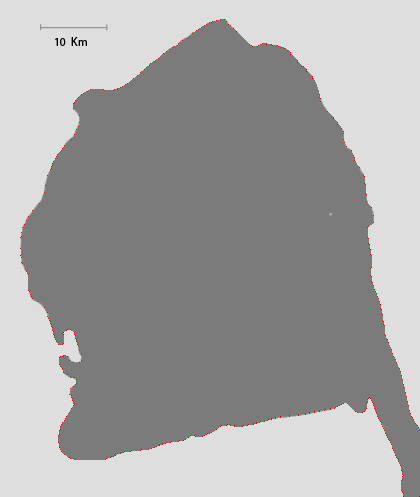

# Cálculo Numérico - CO3211 - Proyecto 2

## Instrucciones sobre los proyectos
* Debe entregar por escrito los resultados numéricos de los distintos problemas planteados, las re-
spuestas a las interrogantes y sus conclusiones.
* Debe enviar el código fuente utilizado como un único archivo comprimido al correo electrónico del
profesor.
* No se reciben entregas extemporáneas sin su debida justificación.
* Estos trabajos son individuales salvo cuando el profesor indique lo contrario. Cualquier similitud
extrema o falta de probidad demostrada en la realización de esta evaluación (código y resultados),
será penalizada con la anulación de la actividad y la sanción administrativa correspondiente.

## Proyecto
Se propone el siguiente problema: hallar una aproximación de la longitud de la lı́nea de costa de la
Penı́nsula de Paraguaná (ver la imagen en el archivo paraguana.bmp) usando splines cúbicos.

Para resolver este problema debe seguir los siguientes pasos:
1. Escriba una función de nombre “SplineCubico” en Matlab que calcule el spline cúbico libre o
amarrado correspondiente a n + 1 puntos (x i , y i ), i = 0, 1, ..., n, cuyas abscisas son todas distin-
tas. Además de las coordenadas de los puntos que determinan al spline, esta función recibirá dos
parámetros opcionales que representan las condiciones de spline cúbico amarrado. Cuando estos
parámetros no estén presentes, se entenderá que la condición de frontera es libre. Como resultado, la función devolverá los coeficientes de los polinomios que conforman el spline.
NOTA: No se puede usar la función “spline” de Matlab.
2. Escriba una función de nombre “LongitudArco” en Matlab que calcule la longitud de una curva,
descrita por un polinomio de grado tres, sobre un intervalo dado. Use la función “quad” de Matlab
para calcular las integrales necesarias.
3. Escriba una función de nombre “Horner” en Matlab que permita evaluar un spline cúbico en un
valor arbitrario x, a partir del método anidado de Horner, dados los puntos que definen al spline y
los coeficientes del mismo.
4. Elija convenientemente un conjunto de puntos sobre la lı́nea de costa, a partir de los cuales generará
los splines cúbicos necesarios para aproximar dicha lı́nea. Debe justificar su elección. La obtención
de las coordenadas de los puntos seleccionados se efectuará en dos etapas: Primero, debe mar-
car cada punto sobre la imagen paraguana.bmp utilizando algún programa de edición de mapas
de bits (como, por ejemplo, Paint de Windows). Cada punto marcado debe corresponder exac-
tamente a un pı́xel de la imagen. Además, debe utilizar color rojo puro (código RGB igual a
(255,0,0)). Luego, debe extraer las coordenadas de los puntos seleccionados, utilizando la función
“captura puntos.m”. Debe tomar en cuenta que las coordenadas suministradas por esta función
vienen dadas en pı́xeles. Suministre el archivo paraguana.bmp con los puntos seleccionados por Ud.
sobre la lı́nea de costa. También debe proporcionar las coordenadas de los puntos extraı́dos con la
función “captura puntos.m”. (Ayuda: es conveniente dividir la lı́nea de costa en varias curvas a fin
de poder aproximar cada una de estas por un spline cúbico).
5. Use el programa “SplineCubico” desarrollado en (1) para calcular cada uno de los splines cúbicos que
aproximan la lı́nea de costa. Grafique todos los splines cúbicos calculados en un solo lienzo gráfico de
Matlab, a fin de verificar visualmente que ha obtenido una aproximación de la lı́nea costera. Cada
vez que necesite evaluar un spline cualquiera en un punto, debe usar el método anidado de Horner.
Comente sobre sus resultados. (Nota: debe suministrar una función de nombre “ContornoCosta”
en Matlab que efectúe todas estas operaciones. Asimismo, debe suministrar el gráfico de la lı́nea
de costa aproximado por los splines, en formato fig de Matlab).
6. Escriba una función de nombre “LongitudLineaCosta” en Matlab, que calcule la longitud aproxi-
mada (en Kilómetros) de la lı́nea de costa de la Penı́nsula de Paraguaná, utilizando la función
“LongitudArco” desarrollada en (2). Explique su procedimiento.
Debe escribir un informe con el análisis del trabajo realizado, de los resultados obtenidos, ası́ como las
conclusiones.

Observación. En el caso de la imagen paraguana.bmp la escala que aparece, equivalente a 10 Km, está
representada por un segmento de recta de 66 pı́xeles. Verificarlo.